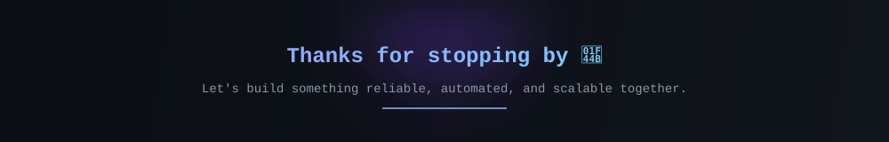

<div align="center">


</div>

---

## About

I'm **Aryan Chavan**, an aspiring **DevOps Engineer** passionate about building reliable infrastructure, automating workflows, and creating intelligent applications.

Current focus:

- Building **SignSpeak**
- Learning Kubernetes & Docker
- Linux Automation
- Cloud Infrastructure
- Python Development
- Open Source

---

## GitHub Overview

<p align="center">


</p>

<p align="center">


</p>

---

## Contribution Activity

<p align="center">


</p>

---

## Technology Stack

<p align="center">


</p>

---

## Featured Projects

<table>

<tr>

<td width="50%">

### 🚀 SignSpeak

AI-powered Sign Language Recognition using Python, OpenCV & MediaPipe.

</td>

<td width="50%">

### 🌐 Portfolio

Modern portfolio built with React and responsive UI.

</td>

</tr>

<tr>

<td width="50%">

### 🐍 Python Practice

Algorithms, automation scripts and experiments.

</td>

<td width="50%">

### 📚 DSA

Data Structures & Algorithms solutions and notes.

</td>

</tr>

<tr>

<td width="50%">

### 🐳 Docker Playground

Containers, Compose files and deployment experiments.

</td>

<td width="50%">

### 🐧 Linux Notes

Commands, shell scripting and server management.

</td>

</tr>

<tr>

<td width="50%">

### ☁ AWS Projects

Cloud learning journey and infrastructure experiments.

</td>

<td width="50%">

### ⚙ Future DevOps Labs

CI/CD, Terraform, Kubernetes and automation projects.

</td>

</tr>

</table>

---

## DevOps Roadmap

```
Python          ████████████████████ 100%

Git             ███████████████████░ 95%

Linux           ██████████████████░░ 90%

Docker          ████████████████░░░░ 80%

GitHub Actions  ███████████████░░░░░ 75%

Terraform       █████████████░░░░░░░ 65%

AWS             ████████████░░░░░░░░ 60%

Kubernetes      ██████████░░░░░░░░░░ 50%
```

---

## Snake Contribution

<p align="center">


</p>

---

<div align="center">


</div>

<div align="center">



</div>
